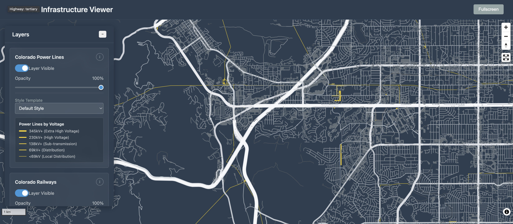

# MBTiles Viewer

A full-stack web application for visualizing vector tile datasets with interactive layer controls, feature inspection, and data-driven styling capabilities. Perfect for testing and exploring MBTiles files with professional cartographic styling.



## Example Dataset
This viewer comes pre-configured with Colorado infrastructure datasets (power lines, railways, roads) to demonstrate capabilities, but can be easily adapted for any MBTiles data.

## Features

### Phase 1 (Implemented)
✅ **Core Infrastructure**
- tileserver-gl-light for optimized tile serving
- FastAPI backend for metadata and coordination  
- MapLibre GL JS frontend with interactive map
- Dataset discovery and metadata extraction
- Unified tile source abstraction

✅ **Interactive Map**
- Dark theme optimized for infrastructure visualization
- Auto-centered on Colorado bounds
- Navigation and fullscreen controls
- Responsive layer control panel

✅ **Layer Management**
- Toggle layer visibility with smooth animations
- Opacity controls with real-time preview
- Dataset information display
- Basic feature inspection on click/hover

## Quick Start

### Prerequisites

1. **Node.js** (for tileserver-gl-light)
   ```bash
   npm install -g tileserver-gl-light
   ```

2. **Python 3.8+** (for FastAPI backend)
   ```bash
   python3 --version
   ```

### Installation & Setup

1. **Install dependencies and start all services:**
   ```bash
   ./scripts/start_services.sh
   ```

   This will:
   - Install Python dependencies in a virtual environment
   - Start tileserver-gl-light on port 8080
   - Start FastAPI backend on port 8000  
   - Start frontend development server on port 3000

2. **Access the application:**
   - **Frontend:** http://localhost:3000
   - **Backend API:** http://localhost:8000
   - **Tileserver:** http://localhost:8080

## Project Structure

```
tileserver-test/
├── backend/                     # FastAPI backend
│   ├── main.py                 # API endpoints and coordination
│   ├── requirements.txt        # Python dependencies
│   └── venv/                   # Virtual environment (created automatically)
├── frontend/                   # Frontend application
│   ├── index.html             # Main application page
│   ├── css/                   # Stylesheets
│   │   ├── style.css          # Main application styles
│   │   └── components.css     # UI component styles
│   └── js/                    # JavaScript modules
│       ├── app.js             # Main application controller
│       ├── layer-controls.js  # Layer management UI
│       ├── feature-popup.js   # Feature inspection
│       └── tile-source.js     # Tile source abstraction
├── data/                      # Data assets
│   ├── mbtiles/              # MBTiles datasets
│   │   ├── co_power_lines.mbtiles
│   │   ├── co_railways.mbtiles
│   │   └── co_roads.mbtiles
│   └── styles/               # MapLibre style configurations
│       ├── co_power_lines_style.json
│       ├── co_railways_style.json
│       └── co_roads_style.json
├── config/                   # Service configurations
│   └── tileserver.json      # Tileserver-gl configuration
├── scripts/                 # Utility scripts
│   └── start_services.sh   # Combined service startup
├── logs/                   # Service logs (created automatically)
└── CLAUDE.md              # Development guidance
```

## API Endpoints

### Dataset Discovery
```
GET /api/datasets
```
Automatic detection and metadata extraction from any MBTiles files in the data directory. Returns bounds, zoom levels, and vector layer information.

### Style Management  
```
GET /api/styles/{dataset_id}
```
Serves MapLibre style configurations. Automatically rewrites tile URLs for seamless integration with tileserver-gl-light.

### Health Check
```
GET /health
```
Backend service health status.

## Development

### Manual Service Management

If you prefer to start services individually:

```bash
# 1. Start tileserver (port 8080)
tileserver-gl-light --config config/tileserver.json --port 8080

# 2. Start backend API (port 8000)
cd backend
python3 -m venv venv
source venv/bin/activate
pip install -r requirements.txt
uvicorn main:app --reload --port 8000

# 3. Start frontend (port 3000)
cd frontend
python3 -m http.server 3000
```

### Log Monitoring

```bash
# Backend logs
tail -f logs/backend.log

# Tileserver logs  
tail -f logs/tileserver.log

# Frontend logs
tail -f logs/frontend.log
```

### Data File Locations

### Adding Your Own Data

To visualize your own MBTiles:

1. **Add MBTiles files** to `data/mbtiles/`
2. **Create style files** in `data/styles/` with matching names (`{filename}_style.json`)
3. **Update configuration** in `config/tileserver.json` if needed

### Example Data (Included)
The viewer includes Colorado infrastructure datasets as examples:
- `co_power_lines.mbtiles` - Power transmission lines
- `co_railways.mbtiles` - Railway infrastructure  
- `co_roads.mbtiles` - Road networks

Each dataset demonstrates different styling approaches: categorical coloring, data-driven sizing, and multi-zoom optimization.

## Troubleshooting

### Port Conflicts
The startup script will detect port conflicts and offer to kill existing processes. You can also manually free ports:

```bash
# Kill processes on specific ports
lsof -ti:3000 | xargs kill -9  # Frontend
lsof -ti:8000 | xargs kill -9  # Backend  
lsof -ti:8080 | xargs kill -9  # Tileserver
```

### Missing Dependencies
```bash
# Install tileserver globally
npm install -g tileserver-gl-light

# Verify Python version
python3 --version  # Should be 3.8+
```

### Data File Issues
Ensure your MBTiles files are:
- Located in `data/mbtiles/`
- Valid MBTiles format with vector tile data
- Accompanied by corresponding style files in `data/styles/`
- Named consistently (spaces and special characters may cause issues)

## Next Steps (Planned Phases)

### Phase 2: Enhanced Interactions
- Feature hover tooltips with key properties
- Detailed click popups with all attributes
- Layer control animations and improved UX
- Dataset metadata display

### Phase 3: Dynamic Styling  
- Data-driven styling based on feature attributes
- Style templates for roads by type, power by voltage
- Categorical and numeric styling options
- Style preview and reset functionality

### Phase 4: Format Extensibility
- PMTiles format support and comparison
- Side-by-side format performance testing
- Format switching in tile source abstraction
- Performance monitoring and metrics

### Phase 5: Polish & Deploy
- Performance optimizations and loading states
- Mobile responsive design
- Comprehensive error handling
- Production deployment configuration

## Use Cases

- **Development & Testing**: Rapidly prototype and test MBTiles datasets
- **Data Exploration**: Interactive exploration of vector tile data with feature inspection
- **Style Development**: Test and refine MapLibre GL styles with real-time preview
- **Performance Testing**: Evaluate tile serving performance and zoom-level behavior
- **Presentation**: Professional visualization for stakeholder demos and data sharing

## Architecture Notes

The application uses a hybrid backend strategy optimized for tile serving performance:
- **tileserver-gl-light**: Optimized C++ tile serving for high-performance delivery
- **FastAPI**: Python API for metadata extraction and style coordination
- **MapLibre GL JS**: Modern vector tile rendering with WebGL acceleration

This architecture provides optimal tile serving performance while maintaining flexibility for metadata operations and future enhancements like feature inspection and dynamic styling.